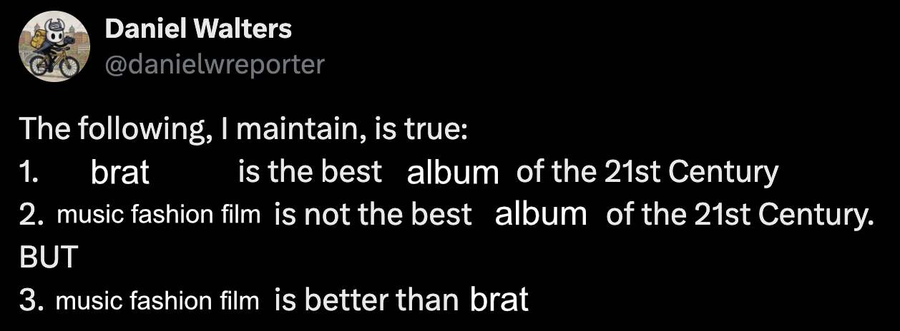

[**I HAVE BEEN AWARE OF THE KILLER SINCE BIRTH**](https://blog.ianmartin.rocks/posts/killer/) **by Ian Martin** 
random interesting blog post about gore/horror games and how desensitized we've become to them. idek how i came upon this, it's possible i had googled the title verbatim to watch the wendy williams killer compilation on youtube for kicks. also namedrops sedgwick whose book touching feeling has NOT been a light reading journey for me currently.

[**Animated ASCII art with HTML video and canvas elements**](https://sometimes.digital/posts/ascii-art-video-stream/) 
has a part at the bottom where you can turn on your webcam and it automatically converts your video into ASCII art live in the browser. very cool!

[**Lessons From a Heated Media Rivalry**](https://fansplaining.com/lessons-from-a-heated-media-rivalry/) **by Elizabeth Minkel of Fansplaining** 
occasionally i like to tune into fandom journalism slapfights. this one is about how the NYT had shamelessly poached fansplaining's article on the proliferation of AI in the heated rivalry ficdom. in the sea of AI-written news articles and bluecheck engagementbait bot account slop, it is genuinely refreshing to read a well-written, well-edited, passionate op-ed about a small potatoes topic that only the chronically online care about.

[**The Emotional Life of Nations**](https://pablohelguera.substack.com/p/the-emotional-life-of-nations) **by Pablo Helguera** 
on telenovelas as a mirror to humanity across cultures, histories, and time. brilliant read, i love this person's longform stuff.

> What fascinated me was the paradox: the more formulaic and portable these narratives became, the more readily viewers seemed to experience them as intimate and culturally specific. The same switched babies, concealed inheritances, impossible romances, and belated recognitions could be transplanted from one national setting to another. Yet every adaptation exposed local anxieties about race, class, gender, family, and social mobility. The telenovela was simultaneously standardized merchandise and a national psychological portrait.
>
> I began to notice patterns in how countries related to telenovelas, and how those relationships revealed something about each nation. Canadian writer Denise Bombardier summarized this with the phrase: “Give me a soap opera and I will give you a nation.” Critic Tomás López-Pumarejo, the institute’s principal theorist, described the form as “the drama of self-recognition”: stories organized around ontological questions—Where is my child? Where is my true love?

[**vanitas**](https://sweetfish.itch.io/vanitas) **by sweetfish** 
genuinely made me emotional, the last page landed like a gut punch. the internet has always been a pretty shit place but if you can make yourself see past the horrors it's true that we've always been Posting. we've always been reaching for each other. i think that's beautiful.

[**Growing Up Foodie**](https://chefmimiblog.com/growing-up-foodie-2/) **by Chef Mimi** 
found this in my bookmarks, also can't remember how i came upon it....i just love reading about people's lives and how they came to be

[**Why one small American town won’t stop stoning its residents to death**](https://archiveofourown.org/works/73396436) **by Charlotte_Stant** 
loveeeee a yuletide fic that goes viral for being shockingly deft and incisive about a wholly esoteric concept (crossover) that someone must've conjured up in a fever dream

[**Floor796**](https://floor796.com) 
i've been following this person's magnum opus art project for a while—recently they started adding timelapse gifs of their isometric animation process which i find really awesome

[**I Found Evidence Of My House Spinning**](https://suricrasia.online/unfiction/spinning/) **by Suricrasia Online** 
i love interactive hypertext fiction, i love it when Form plays with and recontextualizes Story, i love it when things are meta. this was brilliant not because of the high-effort creepypasta storytelling but because the actual twist/revelation was unexpectedly more bone chilling than the story being presented on the surface.

[**AMERICAN FUJO**](https://americanfujo.neocities.org/) 
i've pre-ordered a physical copy but it won't ship for a few months. excited for this to be my december book club read for my book club of 1.

> We asked our contributors questions along those lines: How has being a fan affected your gender or sexuality? How has our gender or sexuality affected how we engage in fandom? Who is a fujoshi, who wants to be one, and who doesn’t get the choice? In America-centric fan spaces, what is necessarily suppressed? How can we trouble the category and dominance of “American” from within and without? Finally, what does it mean to be in a community that’s overwhelmingly virtual, as reliant on digital social platforms as it is on fictional media, both owned by another party? And what affects or acts are uniquely enabled by these virtualized desires and sexuality?
>
> Our contributors range from actual self-identified American fujos to writers who are emphatically neither. They answer these questions through illustration, comics, essays, and autotheory, developing creative ways to capture fandom and its discontents. The anthology surveys a wide range of topics, from transgender fujoshism (in any direction) to race and belonging within theoretically progressive fandom. We want to make the full vibrancy of fandom as accessible as possible, and theorize both its possibilities and its limits through this anthology.

[**red velvet + ninajirachi = ♡゛**](https://www.instagram.com/p/Db4eNyhz_II/) **by itsnetherie** 
beautiful transcendental ipod touch x russian roulette remix by a user who seems to post exclusively on instagram, NO soundcloud to be found anywhere

[**candy pink magic hole flip phone (ft. underscores & Ninajirachi)**](https://www.youtube.com/watch?v=-9nONelNFxw) **by psalmon** 
mainline this into my veins brother. i can't wait to see what else this person comes up with.

[**Music, Fashion, Film**](https://open.spotify.com/album/4bR7pd6TVS53l24qFV4wI8?si=2csl-Br1T0SHPwuwLm4l2A) **by Charli XCX**

i love this album. i think brat was better conceptually and in execution, but i couldn't stop thinking about this one between replays. it's raw and off kilter, shoegazey and rock-ish, without the fun production or remix lineup to distract from her existential anxiety. there is a somber earnestness to her lyrics that pierces through the bulwark of party-girl sarcasm and irony: fears about mortality, obsolescence, and self-worth; that the drugs might actually kill you for real, not just in the ego death way. it teeters between being self-absorbed and utterly mortified but i found her introspection quite endearing, especially in camera (_cause that look, it's a bullet / it makes me question what i'm doing / do i wanna make music? am i being fucking stupid / if i try to be a girl on the screen when i'm turning thirty four / but all i know is how it makes me feel_) — having recently seen her in i want your sex dir. araki i found her acting to be not very good lol, but paired with the context of the song it was clear how she felt about trying her hand at something completely new, wanting it desperately, and caring so much about what people think of her; even then she was still shielded by the satirical, over-the-top nature of her character, giving room for deniability. great movie btw, i saw it twice. olivia wilde is a sexy master manipulator.

no one lasts forever is incredible, btw. eerie but strangely comforting. ending the album with cronenberg's contemplation (_they are dead, they are gone, no one lasts forever_) and then looping back to the irreverence in rock music is a jarring and phenomenal listening experience.
